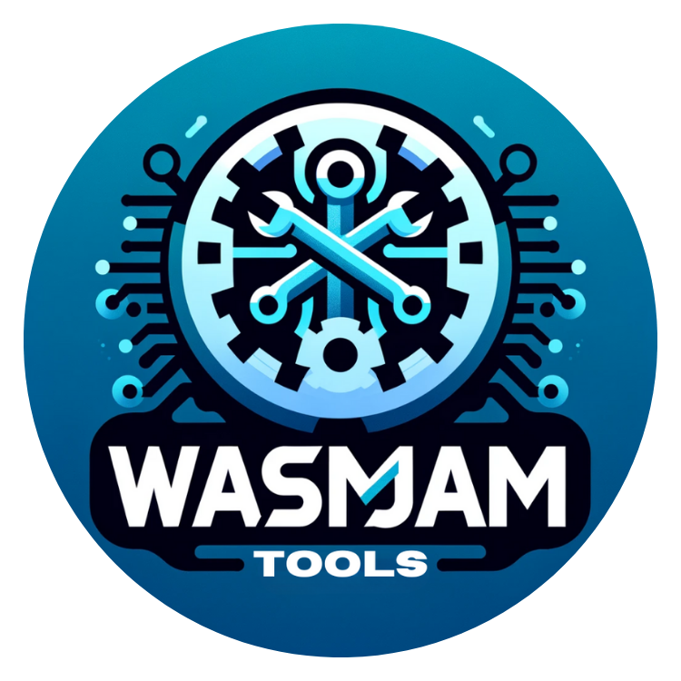

      <h1> Wasm Tools </h1>
      Ultimate Collection WebAssembly (WASM) Toolkit.

## How to install locally

1. Clone the repository to a directory.
2. cd into the directory
3. Make sure you have latest nodejs and vite installed
4. run `npm install`
5. run `npm run dev` to start development server
6. run `npm run build` to build the project
